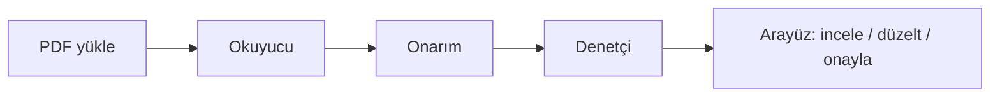

# Kontrata

Otellerin tur operatörlerinden aldığı kontenjan sözleşmesini PDF'den okuyup
yapılandırılmış veriye çeviren masaüstü uygulaması.

[](https://github.com/oz-fatma/kontrata/actions/workflows/ci.yml)

## Sorun

Kontenjan sözleşmesi onlarca sayfa, karışık tablo ve çelişen maddeler içerir.
Otelci fiyat, oda tipi, release ve stop-sale'i elle merkeze işler; bir satır
kayması sezonu bozar. Bulut SaaS'e yüklemek ticari sır (fiyat listesi, kontenjan)
ve KVKK açısından istenmez.

## Nasıl çalışır



1. Kullanıcı PDF yükler. Kayıt hemen **Sırada** (`YUKLENDI`) döner.
2. **Okuyucu** metni çıkarır, maskeler, modele gönderir, JSON adayını onarır
   ve şemaya oturtur.
3. **Denetçi** kural motoruyla (ve isteğe bağlı LLM ile) çelişki ve eksik arar.
4. Kullanıcı detay ekranında alanı düzeltir veya onaylar.

## Neden masaüstü

Sözleşme tesisten çıkmaz. MongoDB ve PDF diski kullanıcı makinesindedir.
Modele giden tek çıkış maskelenmiş metindir. Bu, bulut rakip ürüne karşı
gizlilik argümanıdır. Dağıtım maliyeti: kod imzası ve otomatik güncelleme yok.

## Teknoloji

| Katman | Seçim |
| --- | --- |
| API | Go 1.25, Chi, gqlgen (GraphQL) |
| Veri | MongoDB 8, tek düğümlü replica set (`rs0`) |
| Arayüz | Next.js + TypeScript, static export |
| Kabuk | Electron (macOS arm64/x64, Windows x64) |
| Model | Qwen2.5-1.5B-Instruct, LoRA fine-tune, HuggingFace Inference Endpoint |
| İzleme | Kendi `llm_cagrilari` koleksiyonu (Langfuse yok) |

## Ölçümler

### Fine-tune

| Ölçüt | Değer |
| --- | --- |
| Eğitim | 320 sentetik örnek (`ml/generate.py --seed 42`) |
| Doğrulama | 80 sentetik örnek |
| Dil | yaklaşık %50 Türkçe / %50 İngilizce |
| Val kaybı | 0.290 |
| Token doğruluğu | %92.5 |
| Taban | `Qwen/Qwen2.5-1.5B-Instruct`, LoRA r=16, 3 epoch, Colab T4 |

MEGEP Argos örneği eğitim kümesine **karışmaz**; modelin tek gerçek metni
ezberlemesi istenmez. Ayrıntı: `ml/README.md`.

### Ham çıktı vs onarım

Ham model sık sık markdown çiti, erken kapanmış JSON veya yanlış tipli
tarih/sayı üretir. `internal/extract` önce `RepairJSON` (çit soyma, dengesiz
`}`, ardışık nesne), sonra `Normalize` (enum, tarih ISO, sayı) uygular.
`extract/testdata/dirty_fields.json` ham hali şemayı kırar; Normalize sonrası
`Validate` geçer. Gerçek PDF'te model yine kararsız kalabilir — onarım
sözdizimini kurtarır, uydurma tarihi düzeltmez.

### Yük testi

Aynı PDF, iki eşzamanlılık. Başarısız çağrıların yeniden denemesi kuyruğu
şişirir.

| Eşzamanlılık | Başarı | Toplam süre | p95 |
| --- | --- | --- | --- |
| 4 | %60 | 2m32s | 1m58s |
| 2 | %100 | 1m40s | 1m0s |

Eşzamanlılığı düşürmek hem güvenilirliği hem hızı artırdı: 503/5xx
yeniden denemeleri ortadan kalktı, uçlar ısınmış kaldı.

### Maskeleme

LLM'e giden yolda e-posta, telefon ve 11 haneli sayı örtülür. Örnek:
[`docs/ornek-maskelenmis-metin.md`](docs/ornek-maskelenmis-metin.md).

## Kurulum ve çalıştırma

### Gereksinimler

- Go 1.25+
- Node.js 20+
- Docker (MongoDB replica set)
- macOS paketleme için Xcode CLT; Windows NSIS için Wine (macOS'tan üretiyorsanız)

### Geliştirme

```sh
docker compose up -d
cd backend && cp .env.example .env   # JWT_SECRET ve MONGO_URI
make run                             # :8080

# ayrı uçbirim
cd web && npm install && npm run dev # :3000
```

Sağlık: `GET http://localhost:8080/healthz`.

Masaüstü (API'yi `:17890` üzerinde kendisi açar): `desktop/README.md`.

Yük testi MFA'yı her girişte yeniler; iki adım:

```sh
cd backend
make loadtest-giris
# stdout'taki geçici jeton + API günlüğündeki MFA kodu
make loadtest TOKEN=<gecici> MFA=<kod> SOZLESME=../testdata/sozlesmeler/argos-megep.pdf
# veya tarayıcı erişim jetonu:
make loadtest ERISIM=<erisim-jetonu> SOZLESME=../testdata/sozlesmeler/argos-megep.pdf
```

### Electron paketleme

```sh
cd web && npm ci && npm run build
cd ../backend
make build-darwin    # bin/api-darwin-arm64, api-darwin-amd64
make build-windows   # bin/api-windows-amd64.exe
cd ../desktop
npm ci
npm run package:mac
npm run package:win
```

Çıktı `desktop/dist/` altındadır. **Windows paketi macOS'ta üretildi; Windows
makinede çalıştırılmadı.**

| Paket | Konum | Boyut |
| --- | --- | --- |
| macOS arm64 | `desktop/dist/Kontrata-0.1.0-arm64.dmg` | 113 MB |
| macOS x64 | `desktop/dist/Kontrata-0.1.0.dmg` | 118 MB |
| Windows x64 NSIS | `desktop/dist/Kontrata Setup 0.1.0.exe` | 91 MB |

### Ortam değişkenleri

| Değişken | Zorunlu | Varsayılan | Açıklama |
| --- | --- | --- | --- |
| `PORT` | hayır | `8080` | HTTP kapısı |
| `MONGO_URI` | evet | — | MongoDB URI. Günlüğe yazılmaz |
| `MONGO_DATABASE` | hayır | `kontrata` | Veritabanı adı |
| `GRAPHQL_PLAYGROUND` | hayır | kapalı | `true` ise `/playground` |
| `MAILER` | hayır | `console` | `console` veya `smtp` |
| `SMTP_HOST` / `SMTP_PORT` / `SMTP_USER` / `SMTP_PASSWORD` / `SMTP_FROM` | smtp iken | — | Parola günlüğe yazılmaz |
| `ARGON2_TIME` | hayır | `2` | argon2id yineleme |
| `ARGON2_MEMORY` | hayır | `19456` | KiB |
| `ARGON2_THREADS` | hayır | `1` | paralellik |
| `JWT_SECRET` | evet | — | HS256. Eksikse süreç açılmaz |
| `LLM_ENDPOINT_URL` / `LLM_TOKEN` | hayır | — | Uç 1 |
| `LLM_ENDPOINT_URL_2` / `LLM_TOKEN_2` | hayır | — | Uç 2; boşsa tek uç |
| `LLM_MAX_TOKENS` | hayır | `600` | `max_new_tokens` |
| `LLM_TIMEOUT_SECONDS` | hayır | `240` | HTTP zaman aşımı |
| `LLM_MAX_CONCURRENCY` | hayır | `4` | eşzamanlı çıkarım |
| `LLM_DEBUG_DUMP` | hayır | kapalı | Maskelenmiş istek + ham çıktı diske. Üretimde açma |
| `UPLOAD_DIR` | hayır | `data/uploads` | PDF dizini |
| `LOADTEST_EPOSTA` / `LOADTEST_SIFRE` | yük testi | — | `make loadtest-giris` |

## Güvenlik

- **argon2id** (OWASP varsayılan maliyet), düz şifre yok
- **MFA** 6 hane, 120 sn, 5 deneme
- **Jeton rotasyonu:** erişim JWT 15 dk (e-posta claim yok); yenileme 32 bayt, 7 gün, tek kullanımlık
- **Kayıtlı cihaz** parmak izi özeti; yeni cihaz MFA ister
- **Kiracı yalıtımı:** `organizasyonId` resolver'da; başka kiracı `null`/404
- **Denetim kaydı** kimlik, üye, onay, silme
- **Log maskeleme:** PII ve sözleşme gövdesi yok; LLM öncesi `internal/mask`
- **Hesap sayımı koruması:** `kayitOl` / `dogrulamaTekrarGonder` e-posta kayıtlı olsa da aynı yanıt
- Silme: `docs/kvkk.md`. Mimari: `docs/mimari.md`

## Bilinen sınırlamalar

- **Model kararsızlığı.** Aynı PDF aynı ayarlarla farklı JSON verebiliyor.
  Qwen2.5-1.5B bu görev için sınırda; uzun sözleşmede nesneyi erken kapatıyor.
  Not: `docs/kapsam.md`.
- **Eğitim verisi sentetik.** 320 şablon örneği; gerçek operatör kontratıyla
  tutulmuş bir doğruluk ölçümü yok. Argos MEGEP örneği eğitimde değil.
- **Taranmış PDF yok.** OCR yok; metin katmanı olmayan tarama çıkarılmaz.
- **Kod imzalama yok, otomatik güncelleme yok.** Gatekeeper ve SmartScreen
  uyarır; yeni sürüm elle kurulur.
- **Windows paketi macOS'ta üretiliyor, Windows'ta test edilmedi.**
- **LLM denetçisi pratikte bulgu üretmiyor.** Kural motoru (tarih, fiyat–kontenjan,
  release, zorunlu alan) çalışıyor; yoruma dayalı model katmanı boş veya
  ayrışmıyor kalabiliyor.
- **MongoDB replica set zorunlu.** Hesap silme transaction kullanır;
  `docker compose up -d` `rs0` açar. Eski volume replica setsizse
  `docker compose down -v` ile baştan açın.

Kapsam dışı bırakılanlar ve model yükseltme notu: [`docs/kapsam.md`](docs/kapsam.md).
Teslim kontrol listesi: [`docs/teslim.md`](docs/teslim.md).

## Dizinler

| Dizin | Amaç |
| --- | --- |
| `backend/` | Go servisi |
| `web/` | Next.js arayüz |
| `desktop/` | Electron kabuk |
| `ml/` | sentetik veri, fine-tune, değerlendirme |
| `docs/` | kararlar, KVKK, mimari, teslim |
