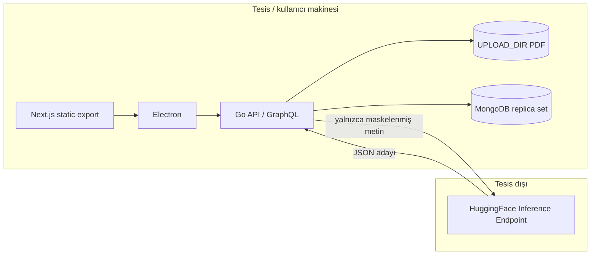
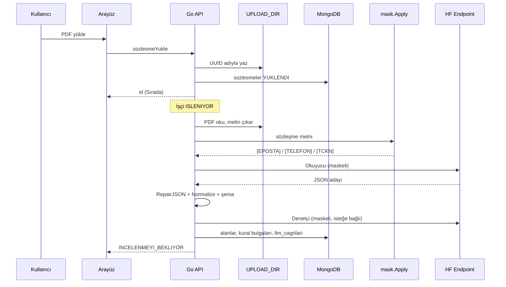

# Mimari

Kontrata üç süreçten oluşur: Electron kabuğu, gömülü Go API, tesisteki MongoDB.
Çıkarım HuggingFace Inference Endpoint'e gider; yolda maskeleme zorunludur.

## Bileşenler

| Bileşen | Görev |
| --- | --- |
| `web/` | Liste, detay, ayarlar, yönetici paneli. `output: 'export'` |
| `desktop/` | Pencere, `kontrata://` şema, API alt süreç, `safeStorage` ayarları |
| `backend/` | Chi + gqlgen. Kimlik, sözleşme, çıkarım kuyruğu, yönlendirici |
| MongoDB | Hesap, sözleşme, denetim, prompt, `llm_cagrilari` |
| HF uç 1 / uç 2 | Fine-tune Qwen2.5-1.5B. Yönlendirici `aktifIstek` ile seçer |

## Veri akışı

Maskeleme, yönetici prompt'undan ve `maxToken` ayarından bağımsızdır.
`llm_cagrilari` süre, uç, agent, hata tipi tutar; gövde tutmaz.

Hesap silinince Mongo kayıtları transaction içinde kalkar; PDF'ler commit
sonrası diskten silinir. Denetim satırları `silinmis` olarak kalır.
Ayrıntı: [`kvkk.md`](kvkk.md).
